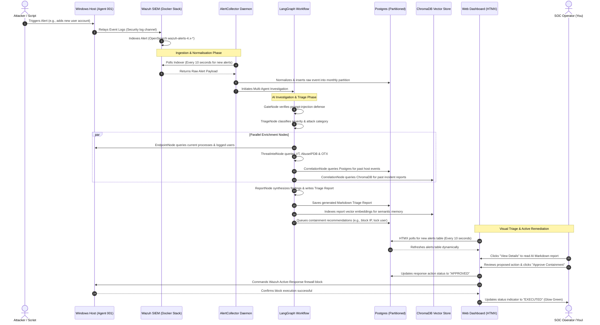

# 🛡️ Live Operations & Threat Simulation Guide ⚡

This guide explains in an easy, step-by-step way how the **Agentic AI SOC Analyst** works in a live deployment. It describes what happens when a threat occurs on your Windows host, how telemetry travels through the pipeline, how the AI makes decisions, and how you can trigger simulations to test it yourself.

---

## 🔄 The Live Telemetry Loop (How It Works)

In a live production setting, the system operates as a continuous, closed-loop telemetry and response pipeline. The loop consists of 5 main stages:

```
[1. Threat Occurs] ──► [2. Wazuh Agent Detects] ──► [3. Wazuh Manager Indexer]
        ▲                                                      │
        │                                                      ▼
[5. Action Dispatched] ◄── [4. Operator Approves] ◄── [Agentic SOC Pipeline]
```

1.  **Threat Event**: An action happens on the host machine (e.g., malware creation, unauthorized user addition).
2.  **Detection**: The locally installed **Wazuh Agent** monitors Windows event logs, system calls, and file hashes. It detects the activity and relays it securely to the **Wazuh Manager** container.
3.  **Ingestion & Queueing**: The Wazuh Manager processes the log, matches it against rules, and indexes it. Our backend's **AlertCollector** daemon queries these logs every 10 seconds, normalizes them, saves them to PostgreSQL, and pushes them to the **LangGraph Analysis Queue**.
4.  **AI Investigation**: The LangGraph pipeline launches, running parallel threat lookups (VirusTotal, AbuseIPDB, past history, host processes) to draft a security report. If it recommends destructive actions (like blocking an IP or isolating a host), it places them in the **Response Action Queue** as `PENDING`.
5.  **Operator Remediation**: The SOC operator views the live alerts, reads the AI-generated report, and clicks **Approve** on the dashboard. The backend instantly commands the host's Wazuh Agent to block the attacker.

---

## 🛣️ Step-by-Step Telemetry Path

Here is a detailed trace of what happens under the hood when a threat is detected:



---

## ⚡ Attack Triggers & Simulations

You can trigger three built-in attack vectors using safe scripts located in the [tests/attack_simulations/](file:///c:/Users/mmddf/Desktop/Agentic%20AI%20SOC%20Analyst/tests/attack_simulations/) folder. Open a **PowerShell terminal as Administrator** and navigate to:
```powershell
cd "c:\Users\mmddf\Desktop\Agentic AI SOC Analyst\tests\attack_simulations"
```

Here is a breakdown of what each simulation does and why it triggers an alert:

### 1. The System Abuse Simulation (`.\system_abuse.ps1`)
*   **What it does**: 
    1. Runs rapid reconnaissance commands (`whoami /priv`, `net user`, `net localgroup Administrators`, `arp -a`, etc.) simulating an attacker mapping the network.
    2. Creates and deletes registry run keys (`HKCU:\Software\Microsoft\Windows\CurrentVersion\Run`) and scheduled tasks (`schtasks.exe /Create /TN "SOCTestPersistence"`) to simulate malware trying to survive host restarts.
    3. Alters a local firewall rule to allow inbound connections on port 4444.
    4. Temporarily appends a test hostname redirection inside `C:\Windows\System32\drivers\etc\hosts`.
*   **Why it triggers**: Wazuh monitors command-line execution and file integrity. Modifying registry keys, firewall rules, scheduled tasks, and the hosts file triggers specific built-in security rules (e.g., Windows Event IDs 4698, 4657, and 7045) which are immediately categorized as highly suspicious.

### 2. The Malware Simulation (`.\malware_sim.ps1`)
*   **What it does**:
    1. Writes the EICAR Standard Anti-Virus Test File string (`X5O!P%@AP[4\PZX54(P...`) to the Desktop and Temp directory.
    2. Creates executable-looking batch and text files inside the Temp folder (e.g., `svchost_update.exe`, `mimikatz.log`, `nc.exe`).
    3. Runs encoded PowerShell base64 strings (`powershell.exe -EncodedCommand ...`).
*   **Why it triggers**: The EICAR test string is recognized by antivirus engines and SIEM agents worldwide as test malware. Creating files with names like `mimikatz.log` or `nc.exe` triggers File Integrity Monitoring (FIM) file-creation alerts. Running encoded commands triggers PowerShell defense evasion indicators.

### 3. The Authentication Attacks Simulation (`.\auth_attacks.ps1`)
*   **What it does**: Simulates a series of failed login attempts followed by a successful login for Okta logs, demonstrating a brute-force pattern.
*   **Why it triggers**: High rates of authentication failures within short time windows indicate automated password-spraying or credential-stuffing attacks.

---

## 🛠️ How to Test It Live (Step-by-Step Walkthrough)

To experience the system operating live, follow these steps:

### Step 1: Start the Docker Infrastructure
Ensure Docker Desktop is running. In your command shell, navigate to the project directory and start the stack:
```bash
docker-compose up -d
```
Verify all 5 services are running:
*   `wazuh.manager` (SIEM)
*   `wazuh.indexer` (OpenSearch Alert Database)
*   `wazuh.dashboard` (Wazuh GUI Console)
*   `soc-postgres` (Relational Alerts and Actions Store)
*   `soc-chromadb` (Chroma Vector Database)

### Step 2: Set Up the Wazuh Agent
If you haven't enrolled your Windows host, run the setup script:
```powershell
.\setup.ps1
```
This script configures the local Windows Wazuh Agent, updates its configuration to monitor log files, and registers it with your local manager.

### Step 3: Run the FastAPI SOC Dashboard
Run the FastAPI web app:
```bash
python -m uvicorn soc_analyst.api.main:app --reload --host 127.0.0.1 --port 8080
```

### Step 4: Login to the Dashboard
Open your browser and navigate to **[http://127.0.0.1:8080](http://127.0.0.1:8080)**.
*   Log in with username **`admin`** and password **`socadmin2026`**.
*   You will see the dark-mode dashboard displaying the unified feeds.

### Step 5: Run a Simulation
Open an **Administrator PowerShell** window and run:
```powershell
cd "c:\Users\mmddf\Desktop\Agentic AI SOC Analyst\tests\attack_simulations"
.\system_abuse.ps1
```
Now switch back to your web browser dashboard:
*   Within 10 seconds, the **Alerts Feed** table will flash and display the new alerts (e.g., Scheduled Task Created, Recon Commands Executed).
*   Click **View Details** on an alert. The dashboard will show the investigation progress.
*   Read the AI-generated Triage Report containing live processes running on your machine and reputation scores.
*   Navigate to the **Response Center** tab. You will find containment actions (e.g., "Add suspicious IP to local watchlist" or "Block attacking host IP") waiting in the queue.
*   Click **Approve** and watch the action execute instantly!
